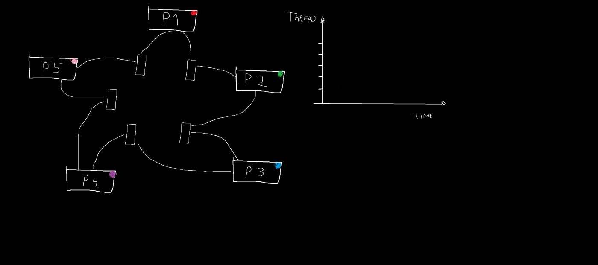

# O problema do jantar dos filósofos

O problema do jantar dos filósofos é um clássico na área de **concorrência**, parte fundamental da **programação paralela e distribuída**. Foi proposto por Edsger Dijkstra para ilustrar os desafios de **sincronização** e **evitar deadlocks** em sistemas paralelos. A ideia é a seguinte:

Cinco filósofos estão sentados ao redor de uma mesa circular. Cada filósofo alterna entre comer e pensar. Para comer, eles precisam pegar dois garfos (um de cada lado do prato). No entanto, só há cinco garfos, então eles precisam coordenar entre si para evitar situações onde todos pegam um garfo e ficam esperando eternamente pelo outro (o que levaria a um deadlock).

## Perspectiva na Programação Paralela e Distribuída

1. **Concorrência**: Cada filósofo representa uma **thread** ou **processo** que compete por recursos compartilhados (os garfos). No contexto de programação paralela, esses processos precisam acessar os recursos de forma **sincronizada** para evitar problemas como **condições de corrida**, onde múltiplos processos tentam acessar o mesmo recurso ao mesmo tempo.

2. **Problemas Clássicos**:
   - **Deadlock**: Se cada filósofo pegar um garfo e esperar pelo outro, ninguém conseguirá comer. Esse é o deadlock, uma situação onde todos os processos ficam presos esperando por recursos que nunca serão liberados. Em sistemas distribuídos, deadlock pode ocorrer quando diferentes nós ou processos aguardam indefinidamente pela liberação de recursos compartilhados.
   - **Starvation (Inanição)**: Mesmo que o deadlock seja evitado, um ou mais filósofos podem nunca conseguir comer se os outros sempre pegarem os garfos antes deles. Em um sistema distribuído, isso ocorre quando certos processos ou nós têm **prioridade menor** ou são constantemente preteridos, levando à ineficiência.

## Solução

### 1. **Locks e Synchronized**

O uso de **locks** e do modificador **synchronized** em linguagens como Java é uma abordagem comum para gerenciar o acesso de múltiplas threads a recursos compartilhados, como os garfos no problema dos filósofos. O conceito de **exclusão mútua** (mutual exclusion) é central aqui.

#### Como funciona:
- Cada filósofo (ou thread) tenta pegar dois garfos (recursos). Para garantir que dois filósofos não peguem o mesmo garfo ao mesmo tempo, usamos **locks**.
- Em Java, isso pode ser implementado com o modificador **synchronized**. Quando um filósofo pega um garfo (ou entra em uma região crítica), ele adquire um **lock** sobre esse garfo, e nenhuma outra thread pode acessar esse recurso até que o lock seja liberado.
